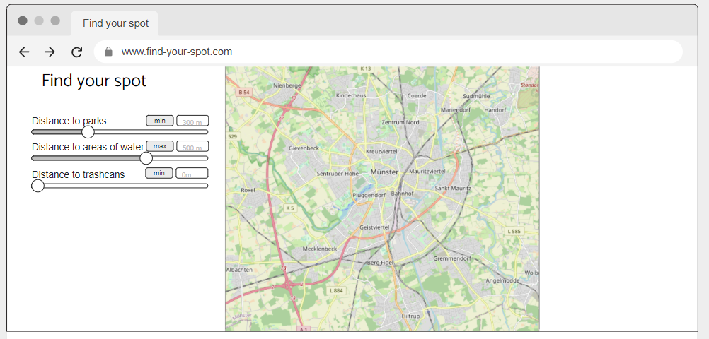
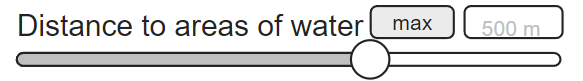
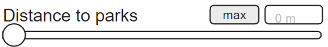
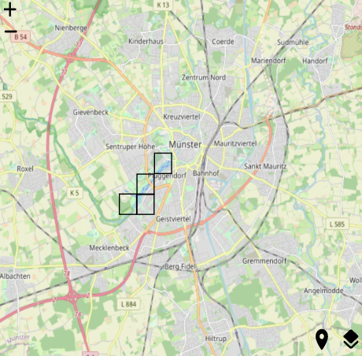

# Geoinformation-in-Society-22
Repository for the course Geoinformation in Society at ifgi in the winter semester 2022.

## Find your Spot
The idea of our project is to help people find their spot in Münster, that meets certain needs. For that we want to build a web app that gives the users the possibility to set distances they want to have to certain features. 

Below you can see a first mockup idea:

The mockup can be found here: https://app.moqups.com/NE302k08PZTUCXujzErZyRm8zPt7fqQn/view/page/a9a777af1
### Example
I want to hang out with friends and want to find a nice spot near to water, in the green with open toilets nearby. 
I could go to the website and set distances to those features. Either with the slider or with the input field above the slider.

This slider says that I want to have water areas at max 500 meters away.

This one says that the distance to parks should be nonexistent. 

As a result you would get a raster overlay on münster that shows you areas that meets your criterias. A prototypical result can be seen below.

## About
This is a project made by Alexander Pilz, Josefina Balzer, Igor Quaresma, Karl Felix Schewe and Phil Hüffer.