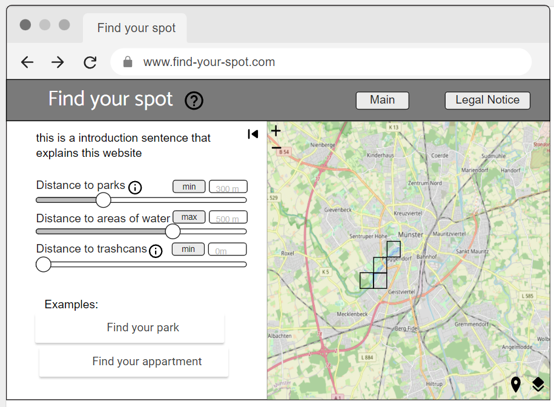

# Find your spot
Repository for the course Geoinformation in Society at ifgi in the winter semester 2022.

## Idea
The idea of our project is to help people find their spot in Münster, that meets certain needs. For that we want to build a web app that gives the users the possibility to set distances they want to have to certain features. 

Below you can see a first mockup idea:


The mockup can be found here: https://app.moqups.com/NE302k08PZTUCXujzErZyRm8zPt7fqQn/view/page/a9a777af1
### Example
I want to hang out with friends and want to find a nice spot near to water, in the green with open toilets nearby. 
I could go to the website and set distances to those features. Either with the slider or with the input field above the slider.


This slider says that I want to have water areas at max 500 meters away.


This one says that the distance to parks should be nonexistent. 

As a result you would get a raster overlay on Münster that shows you areas that meets your criterias. A prototypical result can be seen below.


## Backend
The backend is developed with Python and employs the Flask WSGI. It is configured to use only HTTP 1.1 and should accept cross-origin requests.
A Hello-World "Test" can be accessed via localhost:5050/ while the filtered rasters can be accessed via localhost:5050/request/<params>.
The params-Parameter must conform to the following structure:
```
[(band, minValue, maxValue),...]
```

There are two layers accessable:
```
Kanal 0 Theater            
Kanal 1 Museen		   
Kanal 2 Spielplätze	   
Kanal 3 Sportstätten	   
Kanal 4 Bäder		   
Kanal 5 kinos 
```

The second value in each tuple represents the minium allowed distance in meters while the third value represents the maximum allowed distance in meters.
The distances can be set to ```None```.

The Backend is dockerized and can be started with the correct port mapping with the following command:
```
docker-compose up   
```      

## About
This is a project made by Alexander Pilz, Josefina Balzer, Igor Quaresma, Karl Felix Schewe and Phil Hüffer.
